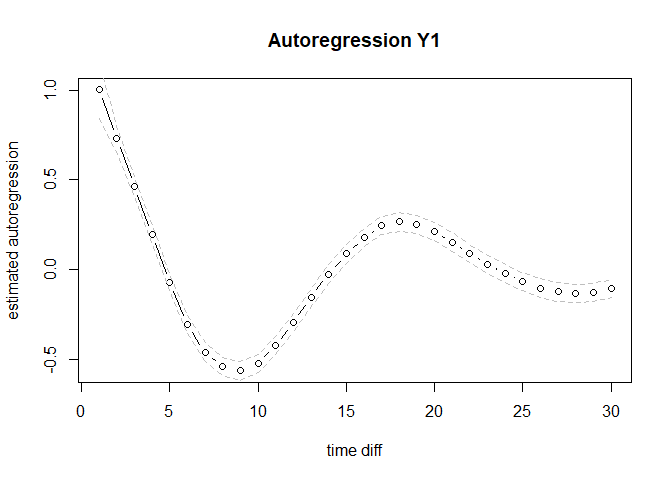
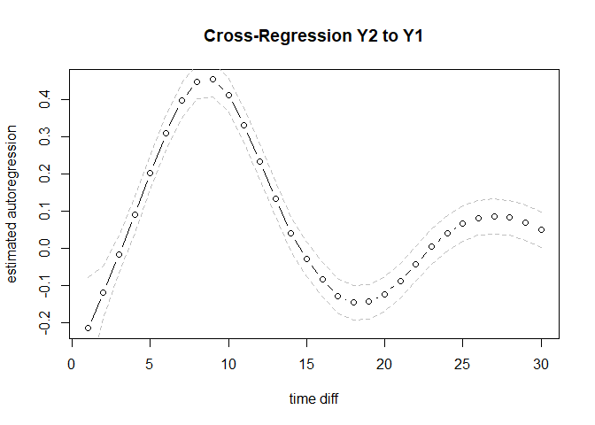

# expct

An `R` package to estimate auto- and cross-correlations from time-series
data sampled with any arbitrary sampling scheme.

The package takes a time-series dataset with measurement timing
information as the input. Relying on a simple data-stacking approach and
Generalized Additive Mixed Models (GAMMs), it allows researchers to:

-   1)  Estimate auto- and cross-correlations at different
        time-intervals requested by the user.

-   2)  Visualize how lagged correlations vary and evolve as a function
        of the time-interval between measurements

-   3)  Construct confidence intervals (CIs) to quantify uncertainty
        around estimated lagged correlations.

## Background

This repository contains an `R` package used by ZZZ (in preperation0) to
qqq

## Installation

The current version of this package can be installed directly from
github using

``` r
devtools::install_github("ryanoisin/expct")
library(expct)
```

## Usage

The package takes as input a time-series dataset or long-format
longitudinal data. The dataset should have the following columns - `id`
a column denoting the id number of each participant in the dataset. Note
that for single-subject time series, this should simply be a column with
a single number repeated, e.g. `data$id = 1` - `time` a column
containing timing information for each observation. The specific format
required is “time elapsed since the **first** observation” in a unit of
the users choice (hours, minutes, etc.). If the first observation of the
dataset is taken at 3pm, and the second observation at 5pm, then the
first two entries of the time column should read `time[1:2] = c(0,2)`. -
The remaining columns should contain records of the observed variables
in long format.

``` r
load("data/simdata.rda")
head(simdata)
```

    ##      id      time          Y1         Y2
    ## [1,]  1  0.000000  1.91866673  0.7673046
    ## [2,]  1  3.338756 -0.76230415  0.6131818
    ## [3,]  1  5.878493 -0.58990520  0.4041070
    ## [4,]  1  7.950279  1.72802101 -0.3894506
    ## [5,]  1 10.060890  1.34938143  1.4604215
    ## [6,]  1 14.870422  0.01682572  3.1393569

The main function of this package is `expct`. Some important input
options of this function are:

-   1)  `dataset`: the dataset in the format described above

-   2)  `Tpred`: A vector which indicates the time-intervals at which
        the user wants to estimate the auto- and cross- correlations.

-   4)  `output_type`: Determines the method used to construct credible
        or confidence intervals. If output_type == “CI”, then default
        GAM confidence intervals are supplied, which can be interpreted
        as “point-wise” CIs for each of the values in `Tpred`. If
        output_type ==“SCI”, then simultaneous CIs are supplied. These
        can be interpreted as “function-wide” CIs, see
        [here](https://fromthebottomoftheheap.net/2016/12/15/simultaneous-interval-revisited/)
        for an introduction. If output_type ==“LLCI”, CIs are computed
        by approximating analytic auto- and cross-correlation standard
        errors from the time-series literature. The default value is
        “CI”. We recommend using either “CI” or “SCI”, with the latter
        being more conservative

The output of this functions is a list which contains below elements:

-   1)  est: The point estimation of lagged correlations between
        covariates and outcomes.

-   2)  highCI: The uppper CI of the point estimation.

-   3)  lowCI: The lower CI of the point estimation.

-   4)  laglongreducedummy: The stacked dataset from the raw data.

-   5)  attributes: All attributes used to estimate GAMMs.

### Example

Perform analyses with `expct`:

``` r
# library(mgcv)
Tpred = seq(1,30,1)

est <- expct(
  dataset = simdata,
  Time = "time",
  outcome = c("Y1","Y2"),
  ID = "id",
  estimate = "marginal",
  Tpred = Tpred,
  plot_show = F,
  quantiles = c(.025, 0.975),
  method = "bam",
)
```

    ## Perform the 1/4 time marginal expct estimation.
    ## Perform the 2/4 time marginal expct estimation.
    ## Perform the 3/4 time marginal expct estimation.
    ## Perform the 4/4 time marginal expct estimation.

Plot output, for instance using

``` r
plot(est$est[[1]], type = "b", ylab = "estimated autoregression", xlab = "time diff", main = "Autoregression X1")
lines(est$highCI[[1]], lty = 2, col = "gray")
lines(est$lowCI[[1]], lty = 2, col = "gray")
```

<!-- -->

``` r
plot(est$est[[2]], type = "b", ylab = "estimated autoregression", xlab = "time diff", main = "Cross-Regression X2 on X1")
lines(est$highCI[[2]], lty = 2, col = "gray")
lines(est$lowCI[[2]], lty = 2, col = "gray")
```

<!-- -->

``` r
# plot(mcr$est[[2]], type = "b", ylab = "estimated autoregression", xlab = "time diff", main = "Cross-Regresion")
# plot(mcr$est[[3]], type = "b", ylab = "estimated autoregression", xlab = "time diff", main = "Autoregression X1")
# plot(mcr$est[[4]], type = "b", ylab = "estimated autoregression", xlab = "time diff", main = "Autoregression X1")
```

## Contact Details

For more details please contact **<o.ryan@uu.nl>**
